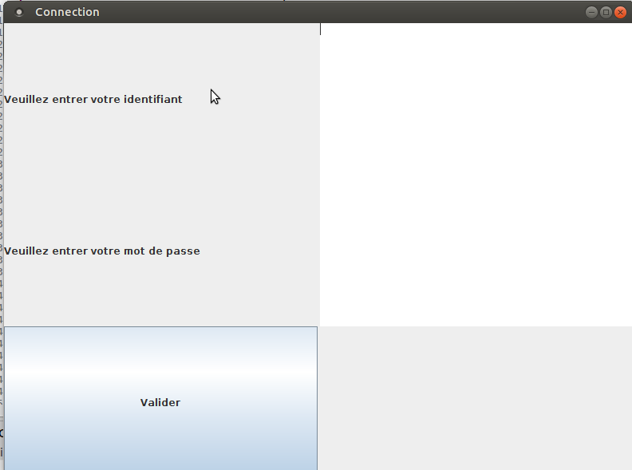
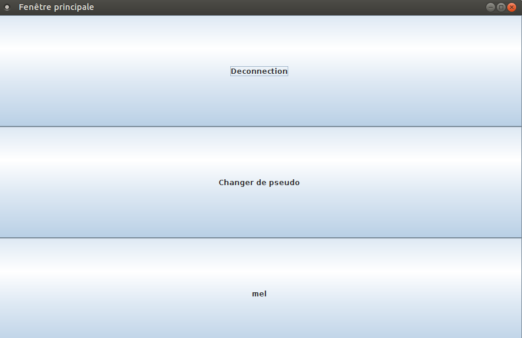
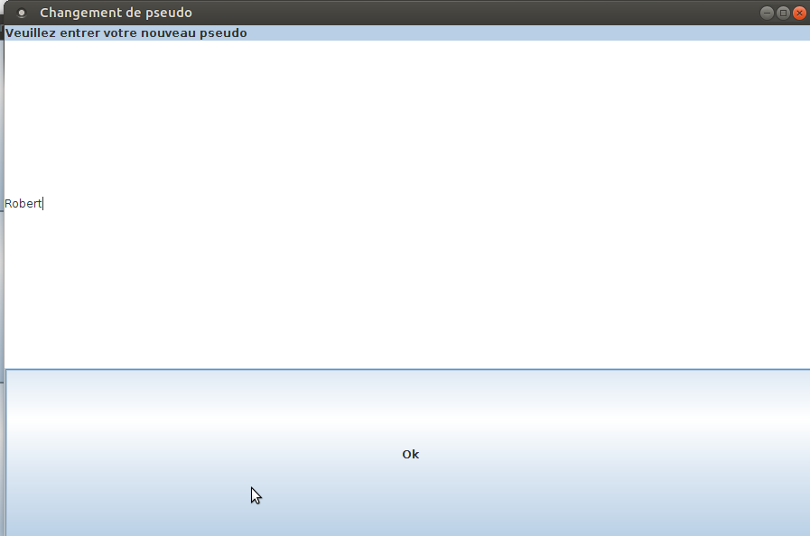
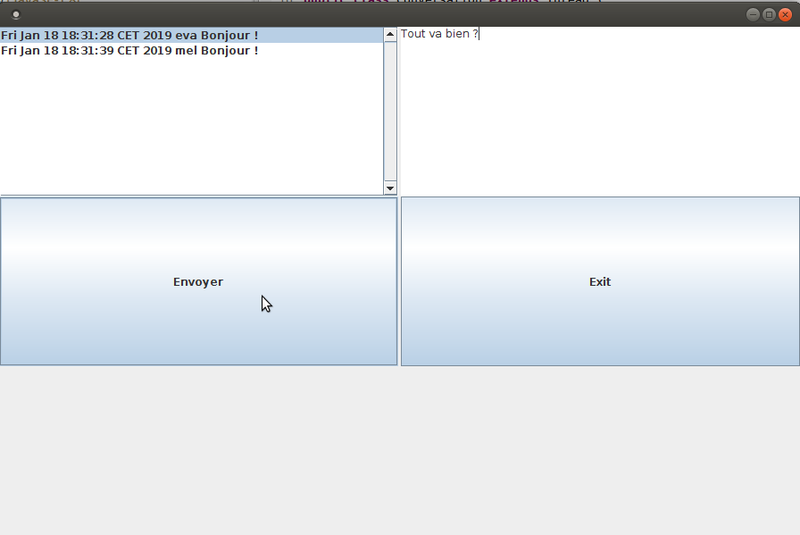
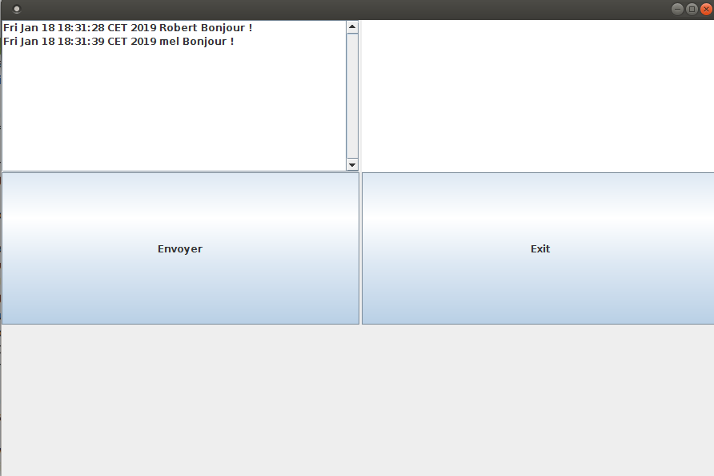

# Manuel Utilisateur

L'application de clavardage est un système de chat, vous permettant de communiquer avec d'autres utilisateurs par le biais de messages. Vous devez appartenir au même réseau, et être actifs pour pouvoir entamer une conversation.
Lors de votre première connection, vous devez choisir un identifiant et un mot de passe qui seront sauvergardés localement sur votre machine pour vous permettre de réacceder au service de chat, et d'assurer la confidentialité de vos conversations.
Vous apparaitrez aux yeux des autres utilisateurs sous votre pseudo, que vous pourrez choisir et modifier à votre guise durant vos sessions de clavardage.

Une seule version est pour l'instant disponible : celle avec le mode de contrôle de présence basé sur UDP.

Fonctionnalités non supportées :
* Envoi d'image ou de fichiers
* Serveur HTTP encore en cours de développement 
* Confidentialité de la base de données

# L'application de clavardage

Voici un guide d'utilisation de l'interface.
Vous trouverez une vidéo de démonstration en suivant ce lien https://drive.google.com/file/d/159ESpJxrA8wpZHuWeRUqR4IeIn6pRjS1/view?usp=sharing.

## Connection

* Lors de votre première connection, vous devrez entrer votre identifiant. Ce doit être le même que celui du réseau d'entreprise sur lequel le système de clavardage sera installé. L'identifiant doit être propre à chacun. Vous devrez également choisir un mot de passe. Ce couple identifiant/mot de passe vous sera redemandé à chaque nouvelle connection.

* Vous apparaitrez sous votre identifiant jusqu'à ce que vous décidiez de choisir un autre pseudo. 

## Fenêtre principale

* Sur la fenêtre principale, vous pouvez choisir de vous déconnecter auquel cas vous n'apparaitrez plus dans la liste des utilisateurs disponibles.

* Vous pouvez aussi choisir de changer de pseudo. Ce pseudo doit être non nul, et surtoût non utilisé par un autre utilisateur. S'il n'est pas disponible, un message apparaît en vous précisant que le pseudo entré est déjà utilisé, et vous pouvez retourner sur la fenêtre précédente afin d'en entrer un autre valide. Si vous fermez la fenêtre, le changement de mot de passe est annulé.

* En dessous, les utilisateurs actifs sur le réseau apparaissent en temps réel dès qu'ils se connectent. Pour initier une conversation, il suffit de cliquer sur le pseudo de l'utilisateur avec qui on veut communiquer et la fenêtre de conversation associée s'ouvre.

Note :
Certaines fois, il est possible que le contenu de la fenêtre apparaisse grisé sans rien à l'intérieur. Ce n'est pas un problème, il suffit d'agrandir puis de rétrécir la fenêtre pour retrouver un affichage consistant.

## Fenêtre de chat

* Il y a ouverture d'une fenêtre de chat pour chaque nouvelle conversation initiée en cliquant sur le pseudo d'un utilisateur.

* Lorsque vous ouvrez une conversation avec un utilisateur, l'ensemble de l'historique des messages entre vous est affiché, même si un de vous a changé de pseudo entre temps. L'affichage des anciens messages est horodaté et affiche le pseudo que vous avez défini au moment de l'ouverture de la conversation. En revanche, cet historique est local, ce qui veut dire que vous devez toujours utiliser le même ordinateur pour y avoir accès.

* La zone à droite de la fenêtre vous permet de saisir vos messages. Il faut appuyer sur le bouton *Envoyer* pour que le message soit transmis au destinataire et affiché sur la zone gauche de la fenêtre.

* Lorsqu'un message est reçu, il est affiché dans la zone gauche de la fenêtre avec le pseudo de la personne qui l'a envoyé ainsi que la date.

* Vous pouvez quitter la conversation en cliquant sur la croix rouge en haut de la fenêtre ou sur le bouton *Exit*.

* Vous êtes informé lorsque votre interlocuteur quitte la fenêtre de chat. Vous ne pouvez plus lui envoyer de messages sur cette fenêtre.

Note :
Certaines fois, il est possible que le contenu de la fenêtre apparaisse grisé sans rien à l'intérieur. Ce n'est pas un problème, il suffit d'agrandir puis de rétrécir la fenêtre pour retrouver un affichage consistant.

# Sauvegarde de l'historique via une base de données

Le choix d'implémentation pour la persistance des données s'est porté sur une sauvegarde locale. Chaque machine enregistre vos conversations. Vous pouvez changer de pseudo entre deux sessions de clavardage et vos messages pourront quand même être restitués dans la fenêtre. 
Seul un utilisateur peut se connecter sur une machine.

Ci-dessous une vision de l'historique récupéré lorsqu'on ré-ouvre une conversation avec un utilisateur :

Note : 
La base de données stocke aussi l'identifiant ainsi que le mot de passe. 
